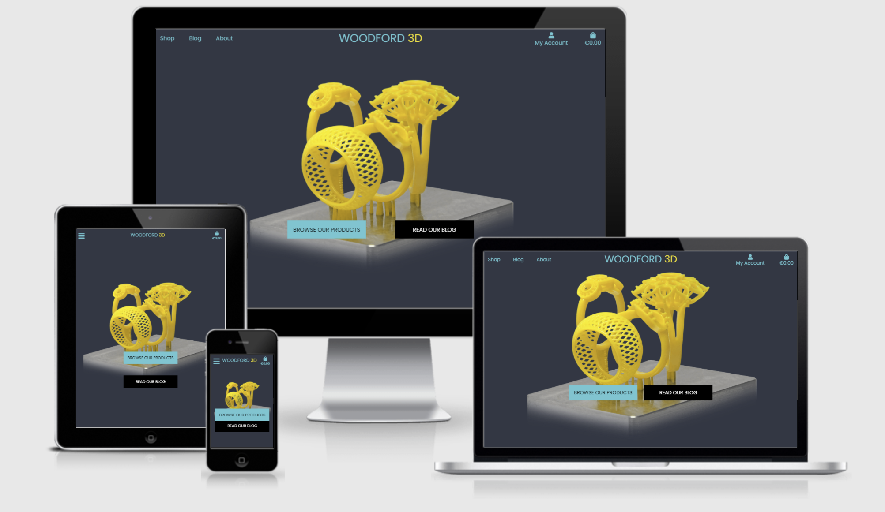

# Woodford 3D - Milestone 4 Project

[Live link](https://woodford3d.herokuapp.com/)

[GitHub Repository](https://github.com/Gilleece/Woodford-3d-milestone-4)

This website is an e-commerce site for a small 3D printing business that sells a limited selection of bespoke goods that are on rotation from time to time. Due to the small business nature and the constant development of the products and designs, a blog is a welcome addition for customers that are interested. The mailing list doubles up as another way for interested people to keep up-to-date with the news of the business. The site is built using Django, Bootstrap and jQuery. Backend, templating and dynamic html generation is handled using Python with certain front-end design elements (such as positioning and timing of the mailing list modal and preview text for the blog) were done using javascript. Payments are provided with Stripe. The mailing list is powered by Mailchimp and the contact form, along with all account/order related emails, are delivered using SendGrid. The site is hosted on Heroku primarily, with static files and images stored on Amazon Web Services. 

# Table of contents
1. [UX](#UX)
    1. [User Stories](#userstories)
2. [Design](#design)
    1. [Colour Scheme](#colour)
    2. [Typography](#typo)
    3. [Layout](#layout)
    4. [Wireframes](#wireframes)
    5. [Database Schema](#schema)
    6. [Formatting](#format)
3. [Features](#features)
    1. [Existing Features](#existing)
    2. [Future Features](#future)
4. [Technologies Used](#tech)
5. [Testing](#testing)
    1. [Manual Testing](#manual)
    2. [Automatic Testing](#auto)
    3. [Bugs](#bugs)
    4. [Known Issues](#issues)
6. [Deployment](#deployment)
    1. [Using Heroku](#heroku)
    2. [Local](#local)
7. [Credits](#credits)
    1. [Tutorials referenced](#tutorials)

## UX 

The site was designed with an extremely clean and minimalist approach in mind. The idea of the business is to have a small number of items that are sold at any one time, so drawing the user's primary attention to these items is key, along with a focus on the attention to detail and passion of the business which is highlighted through the blog. The site deliberately avoids any additional information than what is strictly necessary for the products (Price, image, name, description). The account/payment process is kept as clear and straightforward as possible, with some emphasis on the free shipping threshold as a means of enticing additional sales on the same transaction.

The mailing list that pops up is meant to be useful and non-intrusive. As soon as a customer sees it, regardless of if they sign up or not, a flag is added to local storage through JS with the intention that they will not be pestered by the modal appearing again. This is to keep the site as frictionless as possible while also briefly initally presenting them with the option to stay informed about the business as new products develop. 

### User Stories: 

#### Viewing and Navigation
| #  | User | Wants to...  | So that they can... |
| ------------- | ------------- | ------------- | ------------- |
| 1  | Shopper  |  View a list of products  | Select some to purchase  |
| 2  | Shopper  |  View individual product details | Identify the price, description, product rating, product image and available colors  |
| 3  | Shopper  |  Easily view the total of their purchases at any time | avoid spending too much  |
| 4  | Shopper  |  View the blog | Find out about upcoming new products and projects, along with general news about the business and their process  |
| 5  | Shopper  |  View information about the business | Learn about the quality and process involved  |
| 6  | Shopper  |  Send a message to the business | Ask a question, make a suggestion, ask about a product or purchase  |

#### Registration and User Accounts
| #  | User | Wants to...  | So that they can... |
| ------------- | ------------- | ------------- | ------------- |
| 7  | Site User  | Easily register for an account  | Have a personal account and be able to view their profile |
| 8  | Site User  | Easily login or logout  | Access their personal information  |
| 9  | Site User  | Easily recover their password in case they forgot it  | Recover access to their account  |
| 10 | Site User  | Receive an email confirmation after registering  | Verify that their account registration was successful  |
| 11 | Site User  | Have a personalized user profile  | View their personal order history and order confirmations, and save their payment information  |

#### Sorting and Searching
| #  | User | Wants to...  | So that they can... |
| ------------- | ------------- | ------------- | ------------- |
| 12  | Shopper  | Search for a product by name or description  | Find a specific product they'd like to purchase  |
| 13  | Shopper  | Search for a blog post by name or description  | Find a specific post they'd like to read  |
| 14  | Shopper  | Easily see what they searched for  | To quickly find the product or blog post they are interested in  |

#### Purchasing and Checkout
| #  | User | Wants to...  | So that they can... |
| ------------- | ------------- | ------------- | ------------- |
| 15  | Shopper  | Easily select the colour and quantity of a product when purchasing it  | Ensure they don't accidentally select the wrong product, quanity or colour  |
| 16  | Shopper  | View items in their bag to be purchased  | Identify the total cost of their purchase and all items they will receive  |
| 17  | Shopper  | Adjust the quantity of individual items in their bag  | Easily make changes to their purchase before checkout  |
| 18  | Shopper  | Easily enter their payment information  | Check out quickly and with no hassles  |
| 19  | Shopper  | Feel their personal and payment information is safe and secure  | Confidently provide the needed information to make a purchase  |
| 20  | Shopper  | View an order confirmation after checkout  | Verify that they haven't made any mistakes  |
| 21  | Shopper  | Receive an email confirmation after checking out  | Keep the confirmation of what they've purchased for their records   |

#### Admin and Store Management
| #  | User | Wants to...  | So that they can... |
| ------------- | ------------- | ------------- | ------------- |
| 22  | Store Owner  | Add a product  | Add new items to their store  |
| 23  | Store Owner  | Edit/Update a product  | Change product prices, descriptions, images and other product criteria  |
| 24  | Store Owner  | Delete a product  | Remove items that are no longer for sale  |
| 25  | Store Owner  | Add a blog post  | Add new posts to their blog  |
| 26  | Store Owner  | Edit/Update a blog post  | Change post name, content, and image |
| 27  | Store Owner  | Delete a blog post  | Remove a blog post  |
| 28  | Store Owner  | Make a draft blog post  | Work on a blog post before letting it be viewable publically  |

## Design: 

### Colour Scheme: 

- The site's primary colours are the two shades of blue and the yellow in the image above. The colours are meant to be somewhat reserved and subtle, allowing for attention to be focused on the images of the products and to solidify the minimalist design langue.
- I wanted to deliberately avoid a variety of colour, keeping the site content and information focused. 
- As development continued I decided to also include white for the shopping bag and check out, as it seemed more appropriate and would instill more confidence in the user making a purchase. While the original colours in this context looked appealing, it did not appear quite right for the payment side of things.

### Typography: 
- Site wide, Poppins is used.
- A single font was chosen to keep inline with the minimalist design philosophy. 

### Layout: 
- The site uses a typical layout that customers will feel instantly comfortable with.
- The cart remains visible in the top at all times, regardless of screen size, to ensure that customers can see their total at a glance.
- Any messages presented to the user are done so through a box that pops up at the cart. This keeps the site feeling dynamic whilst also not becoming cluttered.
- The products page is kept simple as a grid layout, presenting the items for sale clearly and effectively. 

### Wireframes: 

- The site's design stayed quite true to the wireframes with the colour scheme and general layout being as was originally envisioned.
- The original wireframe had an image based logo for the company, however this seemed too cluttered in practice so switching to text was decided upon. 

### Database Schema:  

### Formatting:  

- Formatting was assisted with the Black formatter.
- A .flake8 file was added to address certain false flags in the linter, along with helping to keep the project uncluttered and ensure consistent formatting.

## Features 

### Existing Features 
- Responsive on all devices.
- User accounts with passwords properly hashed and cookies for logged in users.
- Users can view past orders on their account, along with storing their details for faster checking out.
- Log in, log out and register functionality, with email confirmation system in place. (Uses SendGrid).
- Search Function on products and blog.
- Contact form (Uses SendGrid).
- Mailing list (uses MailChimp).
- Full ecommerce integration with Stripe payments.
- Notification system using Django toasts.
- Blog that site admins have full CRUD access to through the site's interface (not using Django interface, a more intuitive in site based interface was implemented).
- Site admin also has full CRUD access to the products directly through the site's interface.
- Explanations of all material types present on the site. 
 

### Future Features 
- Blog comments using user accounts, along with profile pictures on the accounts.

## Technologies Used 

1. [HTML:](https://www.w3.org/html/)
    - HTML was used for the content and structure of the site, with emphasis placed on semantic elements and text alternatives for screen readers.
1. [CSS:](https://www.w3.org/Style/CSS/)
    - Bootstrap was used to assist with the responsiveness and styling of the website. 
1. [Python:](https://www.python.org/)
    - All backend was built using Python and Pymongo.
1. [Django:](https://www.djangoproject.com/)
    - MongoDB was the framework for the site.
1. [Javascript:](https://www.javascript.com/)
    - JS was used for dynamic front-end.
1. [Heroku:](https://www.heroku.com/)
    - Heroku was used to host the site and test it in a live environment.
1. [Amazon Web Services:](https://aws.amazon.com/)
    - AWS was used to host the static files and images for the site.
1. [Bootstrap 4:](https://getbootstrap.com/)
    - Bootstrap was used to assist with the responsiveness and styling of the website.
1. [MailChimp:](https://mailchimp.com/)
    - MailChimp was used for the mailing list.
1. [SendGrid](https://sendgrid.com/)
    - SendGrid is used for all email on the site except the mailing list (such as account/order confirmation emails, the contact us form etc)
1. [Font Awesome:](https://fontawesome.com/)
    - Font Awesome was used on all pages throughout the website to add icons for aesthetic and UX purposes.
1. [jQuery:](https://jquery.com/)
    - This was used for certain aspects of dealing with dynamic HTML and displaying front-end.
1. [Git](https://git-scm.com/)
    - Git was used for version control by utilizing the Gitpod terminal to commit to Git and Push to GitHub.
1. [GitHub:](https://github.com/)
    - GitHub is used to store the project's code after being pushed from Git.
1. [Balsamiq:](https://balsamiq.com/)
    - Balsamiq was used to create the wireframes during the design process.   
1. [Gitpod:](https://www.gitpod.io/)
    - This was my IDE for the project. 
1. [Google Fonts](https://fonts.google.com/)
    - I used Google Fonts to provide the font used sitewide. 
1. [Google Fonts](https://fonts.google.com/)
    - I used Google Fonts to provide the font used sitewide. 
1. [SQLite3](https://www.sqlite.org/releaselog/3_32_3.html)
    - I used sqlite as the database during development.
1. [PostgreSQL](https://www.postgresql.org/)
    - I used PostgreSQL as the database for live deployment.
1. [Stripe](https://stripe.com/)
    - Stripe is the payment processor on the site.
1. [Black](https://github.com/psf/black)
    - I used black to help keep consistent and clear formatting across the project.

## Testing 

Testing was carried out both manually and automatically. 

### Manual Testing: 

While building the site I had a preview open in my browser that I would check regularly to ensure that the results were as intended. I made use of developer tools within the browser constantly to check
across a number of things. I would use the console tools to try out different ideas, particularly styling, to see how it worked in real time and then implement the code written there into the project itself.
Responsiveness testing was done both through console tools, along with trying different browsers on different devices. 

My manual testing process was as follows:

#### For each page I performed the following checks:
    * Desktop and mobile
        - Make sure content loads properly, and timely.
        - No errors in console log, or IDE.
        - Try various potential user inputs and search parameters.
        - Try various things like refreshing the page in different sections.
        - Look for results that broke the styling in anyway.
        - Test different scenarios to see if the site continued worked (for example, I would input search parameters that return no results and see if the site continues functioning after this).
        - Ensure that only admin accounts can access certain parts of the site by directly typing in URLs.
    * Mobile only        
        - Try common gestures like pinch to zoom, rotating orientation.  
        - Ensure that the drop down menu worked and that all aspects were usuable at all sizes (such as quantity + and - buttons)   

    All tests were performed across multiple browsers and OS.

Some examples of manual testing procedures are as follows:

#### Testing 1:

- Expected: User fills in the registration form and an account is created.
- Testing: Tested the feature by filling in the registration form and submitting it. 
- Result: The appropriate toast message appears, the cookie is created, the user received a confirmation email, I then follow that procedure and finally go to the profile page to confirm that the account has indeed been created. Further more, manually checking the database shows the user present.

#### Testing 2:

- Expected: User, that has created an account, returns to the site and can log in.
- Testing: Tested the feature by filling in the login form and submitting it.
- Result: The appropriate toast message appears, the cookie is created, and the user is redirected.

#### Testing 3:

- Expected: User can add products to their bag and the correct values and information is shown.
- Testing: Tested the feature by going to the product page and adding multiple items, some with colour options and some without.
- Result: The bag is updated with the appropriate toast message. The delivery fee, along with info on the amount needed to reach the free delivery threshold is present, and the correct total price is displayed.

#### Testing 4:

- Expected: User wishes to contact the site owner.
- Testing: Tested the feature by going to the about page and filling in the "Contact Us" form.
- Result: The email is successfully delivered a short time later using the SendGrid service.

#### Testing 5:

- Expected: User forgets to fill out part of their payment details, which should give the user a warning and not submit the form until all fields have been filled in correctly.
- Testing: Tested the feature by going to the add review page and deliberately leaving one of the fields empty and also again deliberately filling in details that don't match the format.
- Result: The user is alerted as to which field is not correct.

#### Testing 5:

- Expected: User wants to log out.
- Testing: While logged into an account, click on log out.
- Result: The user is logged out correctly and the cookie is removed.

#### Testing 6:

- Expected: Viewing the blog as a non-superuser should only show published posts.
- Testing: While logged into an non-superuser account, go to the blog on the site.
- Result: Only posts marked as "published" are visible.

#### Testing 7:

- Expected: Viewing the site while logged in as a superuser should show additional options for managing site content.
- Testing: While logged into a superuser account, go to the blog, go to the products page and check the profile drop down in the navbar.
- Result: Additional links and posts are visible, that while logged out or logged in as an non-superuser are not accessible. 

#### Testing 8:

- Expected: Manually typing in links for parts of the site only intended for superusers should redirect the user.
- Testing: While logged into an non-superuser account, or not logged in, type in a url such as "https://woodford3d.herokuapp.com/products/edit/2/".
- Result: Successfully redirects the user (to sign in if logged out, or to index.html if logged in as non-superuser)
 
      
### Bugs: 

These are examples of some bugs that my manual testing uncovered, and how I fixed them.

#### Bug 1:

- Expected: Hovering over any parts of the navbar (except for the business name) should have the text turn to yellow. 
- Testing: Tested the feature by hovering over individual elements.
- Result: The bag font awesome icon and the price underneath were showing their hover state independently rather than together.
- Fix: I placed both elements into the same div and through a class tag and css applied the hover effect to both elements at once.

#### Bug 2:

- Expected: When switching to mobile, all content should properly center and be displayed in an easily readible manner.
- Testing: Tested the feature by viewing the website on a mobile device, and also using the mobile device emulator built into the browser.
- Result: Most of the site appeared correctly, except for the quantity section in the bag. This would break across two lines and part would be obscured.
- Fix: I ended up changing the layout significantly, although this was mostly due to wanting to make the section more legible and visually clean. However, upon rebuilding this part of the template I paid specific attention to ensuring that responsiveness remained solid across all size of device.

#### Bug 3:

- Expected: Upon delploying to Heroku and AWS, the site should appear the same as it does on local.
- Testing: After the site was deployed, I manually went through each section of the site to check it if was consistent with the local version.
- Result: Certain image links were broken.
- Fix: Images that used templating language to get the link worked fine. However, the small number of images that are permanent (the empty bag image, the business logo on the checkout_success.html template) were using direct links to their locations (as in "../media/IMAGE_NAME.FILETYPE") however when the files were being accessed from Amazon Web Services the correct non-local link (as in the full https://aws.amazon.com/...) must be used instead. 

#### Bug 4:

- Expected: Site should pass through the W3 Html validator without issue. 
- Testing: Ran the site's various URLs through the W3 validator.
- Result: Errors appeared on index.html. The validator said that there was an opening form tag with no closing form tag. It also, to my surprise, said there was a closing form tag and no opening form tag. The functionality of the form was fine and obviously these two tags were for eachother.
- Fix: As it turns out, the form was split across two divs (due to the layout intention). However, moving the 2 divs inside the form maintained the layout and fixed the validator error.

### Known issues: 

Currently, there are no known issues.

### Automatic Testing: 

W3C Validator HTML resulted in no errors.

W3C Validator CSS resulted in no errors.

Google Lighthouse results:

## Deployment 

### Using Heroku: 

[heroku](https://dashboard.heroku.com) was used for the live deployment of this project, through the master branch of my github repository. The following steps were implemented to deploy this project:

1. Install **gunicorn** package to run the application on Heroku.
    - `sudo pip3 install gunicorn`
2. Install **pycopg2** to connect to PostgreSQL
    - `sudo pip3 install psycopg2`
3. Create a **requirements.txt** file
    - `sudo pip3 freeze --local > requirements.txt`
4. Create a new Heroku application
    - Sign up to a new account if you do not already have one.
    - Create a new application by clicking on `new` then `create new app`.
    - Set the name of your application and select your region and click on `create app` to finalize the creation of your app. 
5. Install PostgreSQL add-on
    - `heroku addons:create heroku-postgresql:hobby-dev`
6. Create a **Procfile** in the root directory
    - content: `web: gunicorn spacex.wsgi:application`
7. Set the following config variables as environment variables:

Config Vars | Value
----------- | -------------
AWS_ACCESS_KEY_ID | `<AWS_ACCESS_KEY_ID>`
AWS_SECRET_ACCESS_KEY | `<AWS_SECRET_ACCESS_KEY>`
DATABASE_URL | `<DATABASE_URL>`
MAILCHIMP_API_KEY | `<MAILCHIMP_API_KEY>`
SECRET_KEY | `<SECRET_KEY>`
SENDGRID_API_KEY | `<SENDGRID_API_KEY>`
STRIPE_PUBLIC_KEY | `<STRIPE_PUBLIC_KEY>`
STRIPE_SECRET_KEY | `<STRIPE_SECRET_KEY>`
STRIPE_WH_SECRET | `<STRIPE_WH_SECRET>`
USE_AWS | `<TRUE>`

5. In the `Deploy` tab, choose `Connect Github` as **Deployment Method** and *Enable Automatic Deployment* from the Github master branch so that any new commit will be automatically deployed through your heroku app. 

### Local Deployment: 

To run the project locally. Install:
* Git
* Django

After installing these you need to:
1. Download this repository clicking in ‘Clone or Dowload’ on top of this page, then click on ‘Download ZIP’ and extract the files in the folder you will be working on.
2. Open the folder where you download the repository in your code editor
3. Create a `.env` file containing the following credentials:

Env Vars | Value
----------- | -------------
AWS_ACCESS_KEY_ID | `<AWS_ACCESS_KEY_ID>`
AWS_SECRET_ACCESS_KEY | `<AWS_SECRET_ACCESS_KEY>`
DATABASE_URL | `<DATABASE_URL>`
MAILCHIMP_API_KEY | `<MAILCHIMP_API_KEY>`
SECRET_KEY | `<SECRET_KEY>`
SENDGRID_API_KEY | `<SENDGRID_API_KEY>`
STRIPE_PUBLIC_KEY | `<STRIPE_PUBLIC_KEY>`
STRIPE_SECRET_KEY | `<STRIPE_SECRET_KEY>`
STRIPE_WH_SECRET | `<STRIPE_WH_SECRET>`
USE_AWS | `<TRUE>`

4. Install the required modules using this command:
`pip -r requirements.txt`

You can run the app by running: `python manage.py runserver`
The project will run at `http://127.0.0.1:8000`

## Credits 
- Thanks to [Reuben Ferrante](https://github.com/arex18), my Code Institute mentor, for his guidance and insight.

- Thanks to the Code Institute Slack community, it was a great resource for issues.

- Credit to the Boutique Ado project from Code Institute.

- Credit to the Django and Bootstrap documentation for their great examples.

### Tutorials referenced: 

- Contact form tutorial: https://www.twilio.com/blog/build-contact-form-python-django-twilio-sendgrid

- Blog tutorial: https://www.youtube.com/watch?v=AF4ji8bb1M8

- Align modal vertically: https://www.tutorialrepublic.com/faq/how-to-align-bootstrap-modal-vertically-center.php#:~:text=Answer%3A%20Use%20the%20CSS%20margin,described%20in%20the%20example%20below.

- Mailing list tutorial: https://www.youtube.com/watch?v=2KeV42YaPes